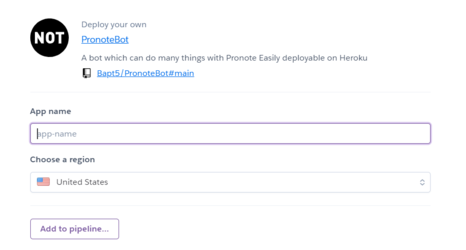
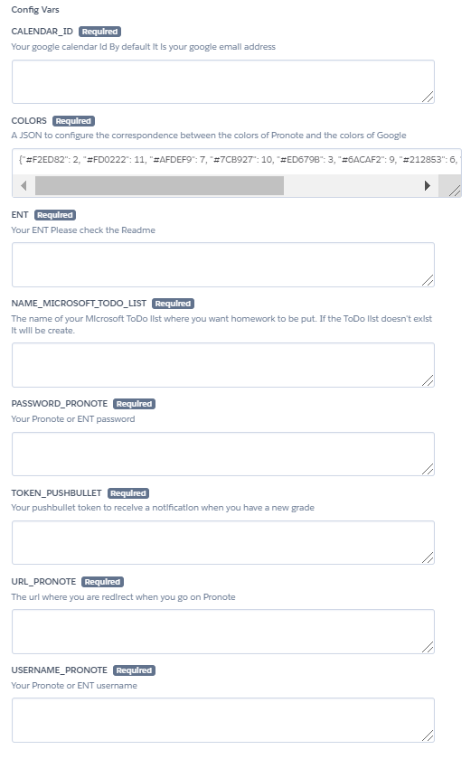
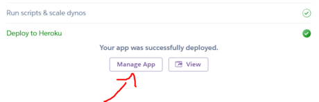
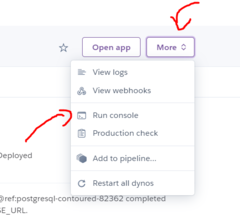
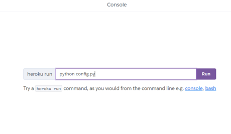

# PronoteBot
A bot which can do many things with Pronote Easily deployable on Heroku

## Deploy to Heroku
* Click on this button to **create an heroku account** and start the **configuration**\
[](https://heroku.com/deploy?template=https://github.com/Bapt5/PronoteBot/tree/main)
* Choose a **name** for your app\

* **Configure variable** with your informations\

  1. The calendar Id is by defauld you google email address
  2. You can you can leave the default value for COLORS
  3. Your ent (leave blank if you don't have an ENT):
    * atrium_sud => ENT Atrium Sud
    * ac_reims => ENT AC Reims
    * occitanie_montpellier => ENT Occitanie Montpellier
    * ENT AC Reunion => ac_reunion
    * ENT Ile de France => ile_de_france
    * ENT PCN => paris_classe_numerique
    * ENT Lyon => ac_lyon
    * ENT AC Orleans-Tours => ac_orleans_tours
    * ENT MonBureauNumerique (Grand Est) => monbureaunumerique
    * ENT Mon collège Essonne => ent_essonne
  4. The name of your Microsoft ToDo list
  5. Your Pronote or ENT password
  6. Your pushbullet token :
    * [go on this website](https://www.pushbullet.com/)
    * create an **account**
    * **install** the pushbullet app on your phone
    * [go on this page](https://www.pushbullet.com/#settings) then create an **Access Token** and **past it** in the config var field
  7. The url where you are redirect when you go on Pronote
  8. Your Pronote or ENT username
* **Deploy** app
* Click on **manage app**\

* Click on **More** and then on **run console** to configure the Microsoft and the Google API\

* Type ```python config.py``` and click on **run**\

* Then **follow the instructions** of the script\
⚠Pay attention in the second step you will be redirected to a page that says "This site is inaccessible" You must **copy the link** and **paste** it in the console⚠
* Your app **is configure** To see the log **click on more** and **view logs**
