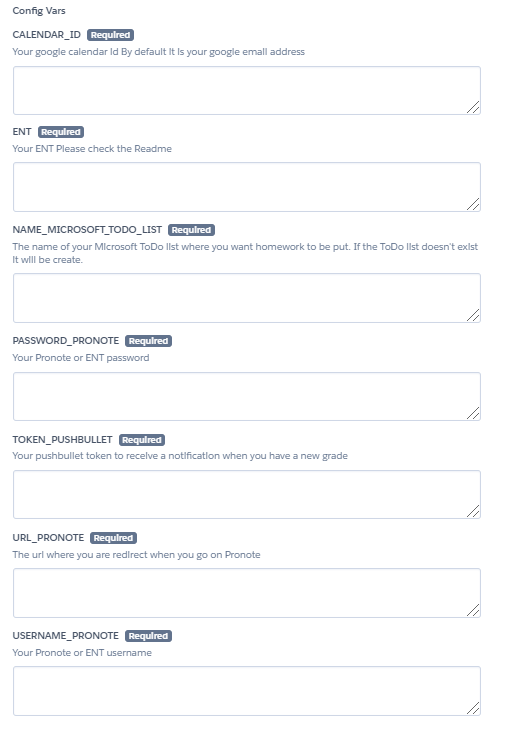

# PronoteBot
A bot which can do many things with Pronote Easily deployable on Heroku

## Deploy to Heroku
* Click on this button to create an heroku account and start the configuration\
[](https://heroku.com/deploy?template=https://github.com/Bapt5/PronoteBot/tree/main)
* Choose a name for your app\

* Configure variable with your informations\

  1. The calendar Id is by defauld you google email address
  2. You can you can leave the default value for COLORS
  3. The name of your Microsoft ToDo list
  4. Your ENT password
  5. Your pushbullet token :
    * [go on this website](https://www.pushbullet.com/)
    * create an account
    * install the pushbullet app on your phone
    * [go on this page](https://www.pushbullet.com/#settings) then create an Access Token and past it in the config var field
  6. Your ENT username
* Deploy app
* Click on manage app\

* Click on More and then on run console to configure the Microsoft and the Google api\

* Type ```python config.py``` and click on run\

* Then follow the instructions of the script\
⚠Pay attention in the second step you will be redirected to a page that says "This site is inaccessible" You must copy the link and paste it in the consolee⚠
* Go to resources page click on the pen enable the app with the slider and then click on confirm\

* Your app is configure To see the log click on more and view logs
